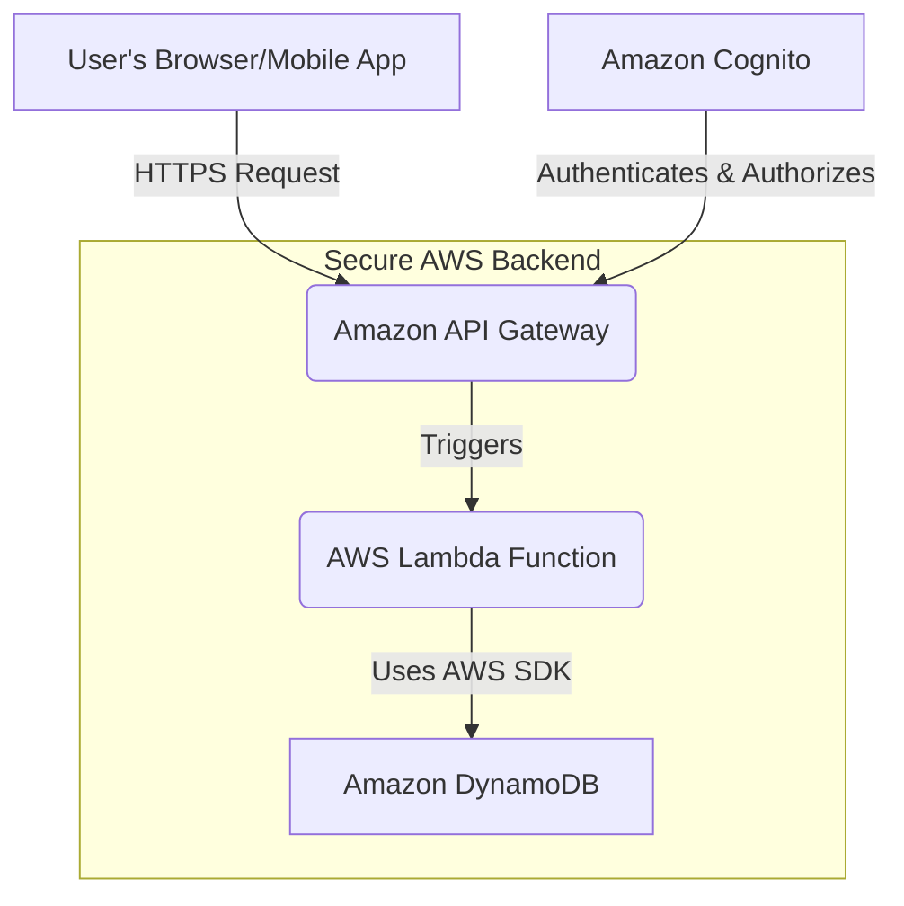
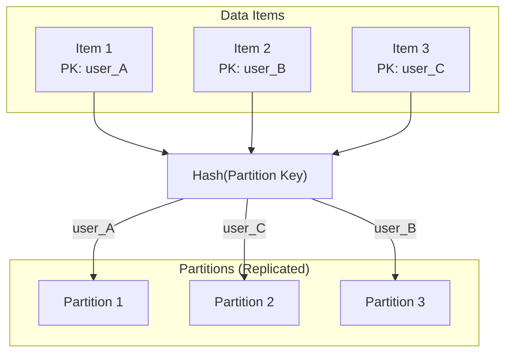
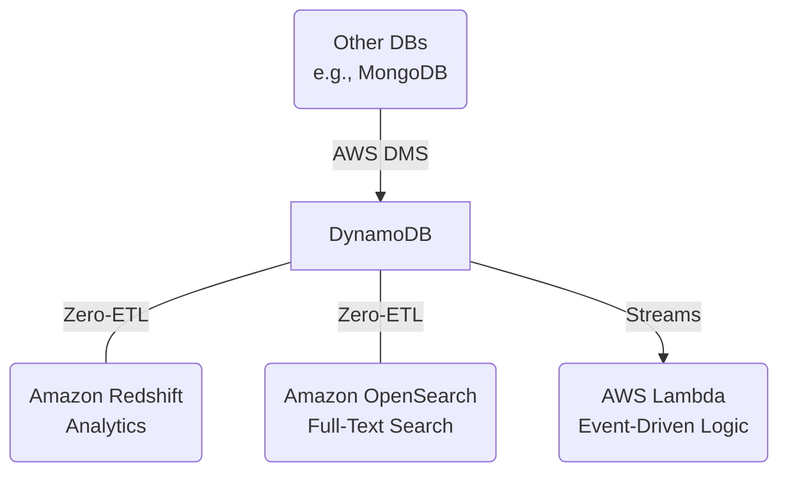

---
# Main frontmatter for the entire presentation
theme: seriph
title: 'Amazon DynamoDB: A Comprehensive Analysis'
author: 'Group 3'

# Add fonts from Google Fonts for a modern look
fonts:
  sans: Nunito Sans
  serif: Roboto Slab
  mono: Fira Code

# Enable downloading the presentation as a PDF from the web interface
download: true
# Set the favicon to our Daystar logo
favicon: "/daystar-logo.png"

# Enable syntax highlighting features
lineNumbers: true
---

---
layout: cover
---

<!--
This is the Title Slide.
The layout 'cover' is a special layout that's often used for titles.
The background image is the Daystar logo we placed in the public folder.
-->
<div class="h-full w-full flex flex-col items-center justify-center text-center">
  
  <h1 class="text-5xl font-bold">Amazon DynamoDB: A Comprehensive Analysis</h1>
  <p class="mt-6 text-2xl">ACS362B: Advanced Database Management Systems</p>
  <p class="mt-2 text-xl description">Mr. Watson Kanuku</p>
</div>


<!--
PRESENTER NOTES:
(William) -> Good morning/afternoon everyone. My name is William, and on behalf of Group 3, I'd like to welcome you to our presentation on Amazon DynamoDB. Over the next few minutes, we'll be exploring what makes this database a cornerstone of modern cloud applications.
Our group members are: [
Kimutai Edwin,
Niyomwungere Bonfils,
Mwambali Irenge Don-Beni,
Brave Joseph Irumva,
Kengere William N. Obino
].
-->

---
layout: default
---

# Presentation Outline

<div class="grid grid-cols-2 gap-x-16 gap-y-8 mt-8">
  <div class="flex items-center" v-click>
    <div class="i-carbon-rocket text-5xl text-[#005276] mr-4"></div>
    <div>
      <h3 class="text-xl font-bold">Introduction</h3>
      <p class="description">What is DynamoDB?</p>
    </div>
  </div>
  <div class="flex items-center" v-click>
    <div class="i-carbon-star-review text-5xl text-[#005276] mr-4"></div>
    <div>
      <h3 class="text-xl font-bold">Outstanding Characteristics</h3>
      <p class="description">The Core Features</p>
    </div>
  </div>
  <div class="flex items-center" v-click>
    <div class="i-carbon-building-insights-1 text-5xl text-[#005276] mr-4"></div>
    <div>
      <h3 class="text-xl font-bold">Areas of Application</h3>
      <p class="description">Powering Industry Leaders</p>
    </div>
  </div>
  <div class="flex items-center" v-click>
    <div class="i-carbon-terminal text-5xl text-[#005276] mr-4"></div>
    <div>
      <h3 class="text-xl font-bold">Access Mechanisms</h3>
      <p class="description">Backend & Frontend</p>
    </div>
  </div>
  <div class="flex items-center" v-click>
    <div class="i-carbon-network-4 text-5xl text-[#005276] mr-4"></div>
    <div>
      <h3 class="text-xl font-bold">Distribution & Optimization</h3>
      <p class="description">The Engine Under the Hood</p>
    </div>
  </div>
  <div class="flex items-center" v-click>
    <div class="i-carbon-security text-5xl text-[#005276] mr-4"></div>
    <div>
      <h3 class="text-xl font-bold">Security & Integration</h3>
      <p class="description">A Robust Ecosystem</p>
    </div>
  </div>
</div>

<!-- 
PRESENTER NOTES:
(Presenter 2) -> Thank you, William.
Here's a quick look at our agenda for today. We'll start with a basic introduction to DynamoDB, then dive into its standout features. We'll look at real-world companies using it today, and then get into the technical details of how to access and optimize it. Finally, we'll cover security and integration before summarizing our key takeaways.
-->

---
layout: center
class: 'text-center'
---

# What is Amazon DynamoDB?

A fully managed, serverless, NoSQL database designed for **internet-scale applications**.

<div class="grid grid-cols-3 gap-8 mt-10">
  <div v-click>
    <div class="i-carbon-flash text-5xl text-yellow-500 mx-auto"></div>
    <h3 class="font-bold mt-2">Performance at Scale</h3>
    <p class="text-sm description">Single-digit millisecond latency, regardless of size.</p>
  </div>
  <div v-click>
    <div class="i-carbon-cloud-services text-5xl text-blue-500 mx-auto"></div>
    <h3 class="font-bold mt-2">Fully Managed</h3>
    <p class="text-sm description">No servers to provision, patch, or manage. It's serverless.</p>
  </div>
  <div v-click>
    <div class="i-carbon-document-multiple-01 text-5xl text-green-500 mx-auto"></div>
    <h3 class="font-bold mt-2">Flexible Schema</h3>
    <p class="text-sm description">Supports both Key-Value and Document data models.</p>
  </div>
</div>

<!--
PRESENTER NOTES:
(Presenter 2) -> So, what exactly is DynamoDB? At its core, it's a NoSQL database provided by AWS. But what makes it special are three key things.
First, its performance. It’s built to provide incredibly fast, single-digit millisecond response times, even when handling trillions of requests per day.
Second, it's fully managed and serverless. This is a game-changer because it means developers don't have to worry about the underlying hardware, software updates, or scaling. You just create a table and start using it.
And third, it offers a flexible schema. Unlike traditional relational databases, you don't have to define all your columns upfront. This makes it perfect for applications that need to evolve quickly.
-->

---
layout: default
---

# Outstanding Characteristics

<div class="grid grid-cols-2 gap-8">
<div>

### Core Features
<div class="space-y-4 mt-4">
  <div class="flex items-start" v-click><div class="i-carbon-ibm-cloudant text-3xl mr-3 text-blue-500"></div><div><strong>Serverless Architecture</strong>: Focus on code, not on servers.</div></div>
  <div class="flex items-start" v-click><div class="i-carbon-document-multiple-01 text-3xl mr-3 text-green-500"></div><div><strong>Flexible Data Model</strong>: Key-Value & Document stores.</div></div>
  <div class="flex items-start" v-click><div class="i-carbon-globe text-3xl mr-3 text-teal-500"></div><div><strong>Global Tables</strong>: Active-active, multi-region replication.</div></div>
  <div class="flex items-start" v-click><div class="i-carbon-stamp text-3xl mr-3 text-red-500"></div><div><strong>ACID Transactions</strong>: Ensures data integrity across multiple items and tables.</div></div>
</div>

</div>
<div>

### Advanced Capabilities
<div class="space-y-4 mt-4">
  <div class="flex items-start" v-click><div class="i-carbon-lightning text-3xl mr-3 text-yellow-500"></div><div><strong>DynamoDB Accelerator (DAX)</strong>: In-memory cache for microsecond reads.</div></div>
  <div class="flex items-start" v-click><div class="i-carbon-wave-direction text-3xl mr-3 text-purple-500"></div><div><strong>DynamoDB Streams</strong>: React to data changes in real-time.</div></div>
  <div class="flex items-start" v-click><div class="i-carbon-time text-3xl mr-3 text-gray-500"></div><div><strong>Time to Live (TTL)</strong>: Automatically expire and delete items.</div></div>
</div>

</div>
</div>


<!--
PRESENTER NOTES:
(Presenter 3) -> Building on that, let's look closer at its characteristics.
On the core side, we've already mentioned its serverless nature and flexible model. A key feature for global applications is Global Tables, which lets you create a single database that is replicated and active in multiple AWS regions at once. This gives users around the world fast, local access to their data. It also supports ACID transactions, which is a feature often associated with relational databases, guaranteeing data correctness.
On the advanced side, DAX, or DynamoDB Accelerator, provides an in-memory cache that can boost read performance from milliseconds to microseconds. And DynamoDB Streams is a powerful feature for building event-driven architectures; it allows you to trigger other processes, like an AWS Lambda function, whenever data in your table changes.
-->

---
layout: center
class: 'text-center'
---

# Areas of Application: Powering Industry Leaders

DynamoDB is trusted by thousands of companies for their most demanding applications.

<div class="grid grid-cols-3 gap-y-8 mt-10">
  <div v-click>
    <h3 class="font-bold">Media & Entertainment</h3>
    <div class="flex justify-center items-center space-x-4 mt-2 text-5xl">
      <div class="i-simple-icons-netflix text-red-600"></div>
      <div class="i-simple-icons-disneyplus text-blue-900"></div>
    </div>
  </div>
  <div v-click>
    <h3 class="font-bold">E-commerce & SaaS</h3>
    <div class="flex justify-center items-center space-x-4 mt-2 text-5xl">
      <div class="i-simple-icons-amazon text-[#FF9900]"></div>
      <div class="i-simple-icons-dropbox text-blue-600"></div>
    </div>
  </div>
  <div v-click>
    <h3 class="font-bold">FinTech & Education</h3>
    <div class="flex justify-center items-center space-x-4 mt-2 text-5xl">
      <div class="i-simple-icons-capitalone text-red-700"></div>
      <div class="i-simple-icons-duolingo text-green-500"></div>
    </div>
  </div>
</div>

<!--
PRESENTER NOTES:
(Presenter 3) -> So, who actually uses this? The answer is: some of the biggest names in tech.
In Media, Disney+ and Netflix use it to handle billions of user interactions daily, from updating watchlists to storing user profiles.
In E-commerce, Amazon's own retail site migrated many of its critical services to DynamoDB to handle its massive scale. SaaS companies like Dropbox use it for metadata storage.
And in FinTech and Education, companies like Capital One and Duolingo rely on it for its speed and reliability to power their mobile applications. This shows its versatility across many different industries.
-->

---
layout: default
---

# Backend Access: SDKs & CLI

Interact with DynamoDB from a secure backend using AWS SDKs.

<!-- By adding maxHeight, the code block becomes scrollable if it exceeds the height -->
```python {all|3-4|7-14|17-21|24-29|32-35} {maxHeight: '380px'}
import boto3

# 1. Initialize the DynamoDB resource.
dynamodb = boto3.resource('dynamodb')
table = dynamodb.Table('Users')

# 2. Create (or overwrite) an item.
table.put_item(
   Item={
        'user_id': '12345',
        'username': 'johndoe',
        'email': 'johndoe@example.com'
    }
)
```

<!--
PRESENTER NOTES:
(Presenter 4) -> First, we have the code to create an item.
(CLICK) We start by importing the Boto3 library and initializing our connection to the 'Users' table. This is the setup required for any operation.
(CLICK) Next, we call the `put_item` method. You provide it with a dictionary representing the item you want to save. It's important to know that `put_item` will create the item if it doesn't exist, but it will replace the entire item if it already does.
-->

---
layout: default
---

# Backend Access: Read Item (`get_item`)

To retrieve a single item, we use `table.get_item()`, providing the unique primary key of the item we want. The item's data is found within the `Item` key of the response.

```python
# Read an item.
response = table.get_item(
    Key={
        'user_id': '12345'
    }
)

item = response.get('Item')

# print(item)
# {'user_id': '12345', 'username': 'johndoe', 'email': 'johndoe@example.com'}
```

<!--
PRESENTER NOTES:
(Presenter 4) -> To read data, we use `get_item`. This is a highly efficient operation. You simply pass the primary key of the item you need, and DynamoDB returns it. The actual data will be inside the 'Item' field of the response.
-->

---
layout: default
---

# Backend Access: Update Item (`update_item`)

The `table.update_item()` method is used to modify specific attributes of an existing item without replacing the whole item. This is more efficient than a `put_item` for partial updates.

```python
# Update an item.
response = table.update_item(
    Key={'user_id': '12345'},
    UpdateExpression='SET #em = :new_email',
    ExpressionAttributeNames={'#em': 'email'},
    ExpressionAttributeValues={':new_email': 'john.doe@newdomain.com'},
    ReturnValues='UPDATED_NEW'
)

# print(response['Attributes'])
# {'email': 'john.doe@newdomain.com'}
```
<!--
PRESENTER NOTES:
(Presenter 4) -> For modifying existing data, `update_item` is the best choice. Unlike `put_item`, it only changes the attributes you specify. Here, we're using an `UpdateExpression` to set a new value for the email attribute. This is much more efficient for small changes.
-->

---
layout: default
---

# Backend Access: Delete Item (`delete_item`)

Finally, `table.delete_item()` is used to permanently remove an item from the table. Like `get_item`, it identifies the item to be deleted by its primary key.

```python
# Delete an item.
table.delete_item(
    Key={
        'user_id': '12345'
    }
)
```

<!--
PRESENTER NOTES:
(Presenter 4) -> And to remove an item, we use the straightforward `delete_item` method, again specifying the item by its primary key. These four operations are the building blocks for any application interacting with DynamoDB.
-->


---
layout: default
---

# Frontend Access: The Secure Architecture

Direct frontend access is insecure. The best practice is to use an API layer.

<div class="w-full h-90 flex items-center justify-center">

<!-- Mermaid diagram styling is now fully handled by style.css -->


</div>

<!--
PRESENTER NOTES:
(Presenter 4) -> What about accessing data from a frontend, like a web or mobile app?
It's critical that you **never** put your AWS credentials directly in your frontend code. This is a major security risk.
The correct and secure architecture is to build an API layer that acts as an intermediary. This diagram shows the standard serverless pattern.
The user's application makes a request to an Amazon API Gateway endpoint.
API Gateway then triggers an AWS Lambda function.
This Lambda function contains the backend logic, like the Python code we just saw, to securely interact with DynamoDB.
To handle user authentication, you would use a service like Amazon Cognito, which can authorize users and ensure they only have permission to access their own data.
-->

---
layout: default
---

# Distribution & Optimization

<div class="grid grid-cols-2 gap-8 mt-6">
<div>

### Distribution
<!-- Mermaid diagram with styling handled by style.css -->


</div>
<div>

### Optimization Best Practices
<v-clicks>

- **High-Cardinality Partition Key**: Choose a key with many unique values (like `user_id`, `order_id`) to prevent "hot partitions".
- **Use `Query` over `Scan`**: A `Query` operation is fast and efficient. A `Scan` reads the entire table and should be avoided in production.
- **Leverage Secondary Indexes**: Create Global Secondary Indexes (GSIs) to enable efficient queries on non-key attributes.
- **Manage Capacity**: Use **On-Demand** for unpredictable workloads or **Provisioned** for predictable traffic to optimize costs.

</v-clicks>
</div>
</div>

<!--
PRESENTER NOTES:
(Presenter 5) -> So, how does DynamoDB achieve this scale and performance? It boils down to two things: distribution and optimization.
For distribution, DynamoDB uses partitioning. When you write an item, it takes the partition key and passes it through a hash function. This determines which physical partition the data is stored on.
This leads us to optimization. The most important best practice is to choose a partition key with many unique values to ensure your data is spread evenly. Always use the fast `Query` operation, and avoid the slow and expensive `Scan`. And finally, manage your costs by choosing the right capacity mode for your application's traffic pattern.
-->

---
layout: default
---

# Security & Integration

DynamoDB is secure by default and deeply integrated into the AWS ecosystem.

<div class="grid grid-cols-2 gap-8 mt-6">
<div>

### Multi-Layered Security
<v-clicks>

- **IAM (Identity & Access Management)**: Granular permissions for users and roles.
- **Encryption at Rest & In-Transit**: Data is automatically encrypted by default.
- **VPC Endpoints**: Keep traffic within your private AWS network.
- **CloudTrail Auditing**: Log all API calls for security and compliance.

</v-clicks>

</div>
<div>

### Seamless Integration
<!-- This diagram is now fixed. The faulty classDef is removed. -->

</div>
</div>

<!--
PRESENTER NOTES:
(Presenter 5) -> Security is built-in at every layer. Access is controlled by IAM, which allows you to define exactly who can do what. All data is encrypted both at rest on AWS servers and in-transit over the network. And all activity is logged for auditing.
Beyond security, DynamoDB's power is amplified by its integration with other AWS services.
A key feature is **Zero-ETL integrations**. This allows you to automatically replicate your DynamoDB data into services like Amazon Redshift for data analytics or OpenSearch for full-text search, without writing any complex data pipeline code.
For custom integrations, you can use DynamoDB Streams to trigger Lambda functions, or use the AWS Database Migration Service to move data between DynamoDB and other databases.
-->

---
layout: center
class: 'text-center'
---

# Conclusion & Key Takeaways

<div class="grid grid-cols-1 gap-6 mt-8">
  <div v-click>
    <h3 class="font-bold text-2xl">1. Scalable & Serverless by Default</h3>
    <p class="text-lg description">A premier choice for applications requiring massive scale with minimal operational overhead.</p>
  </div>
  <div v-click>
    <h3 class="font-bold text-2xl">2. Data Modeling is Everything</h3>
    <p class="text-lg description">Performance and cost are directly tied to how you design your primary keys and access patterns. Think about queries first.</p>
  </div>
  <div v-click>
    <h3 class="font-bold text-2xl">3. A Pillar of the AWS Ecosystem</h3>
    <p class="text-lg description">Its true strength is amplified by its deep integration for security, analytics, and event-driven architectures.</p>
  </div>
</div>


<!--
PRESENTER NOTES:
(William) -> To wrap things up, here are our key takeaways.
First, DynamoDB is a powerful, serverless database that's built for scale. If you're building a large-scale application and want to minimize operational work, it's an excellent choice.
Second, to use it effectively, you have to think differently than you would with a relational database. Your data model, especially your primary key, is the most important decision you'll make. Design for your access patterns.
And finally, DynamoDB doesn't exist in a vacuum. Its deep integration with the rest of the AWS ecosystem is what makes it a true pillar of modern cloud applications.
-->

---
layout: center
class: 'text-center'
---

# Thank You

## Questions?

<br/>

<p class="description">
Kimutai Edwin,
Niyomwungere Bonfils,
Mwambali Irenge Don-Beni,
Brave Joseph Irumva,
Kengere William N. Obino
</p>


<!--
PRESENTER NOTES:
(William) -> Thank you for your attention. We are now happy to answer any questions you may have.
-->