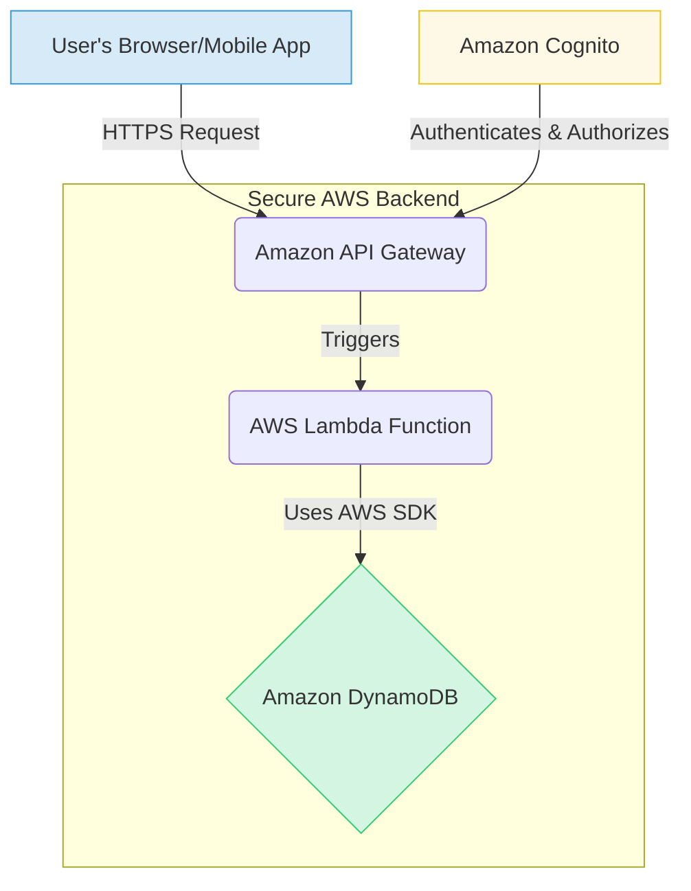
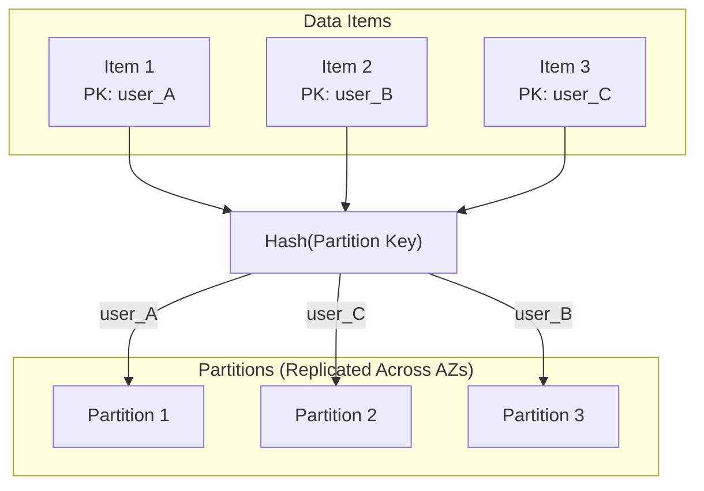
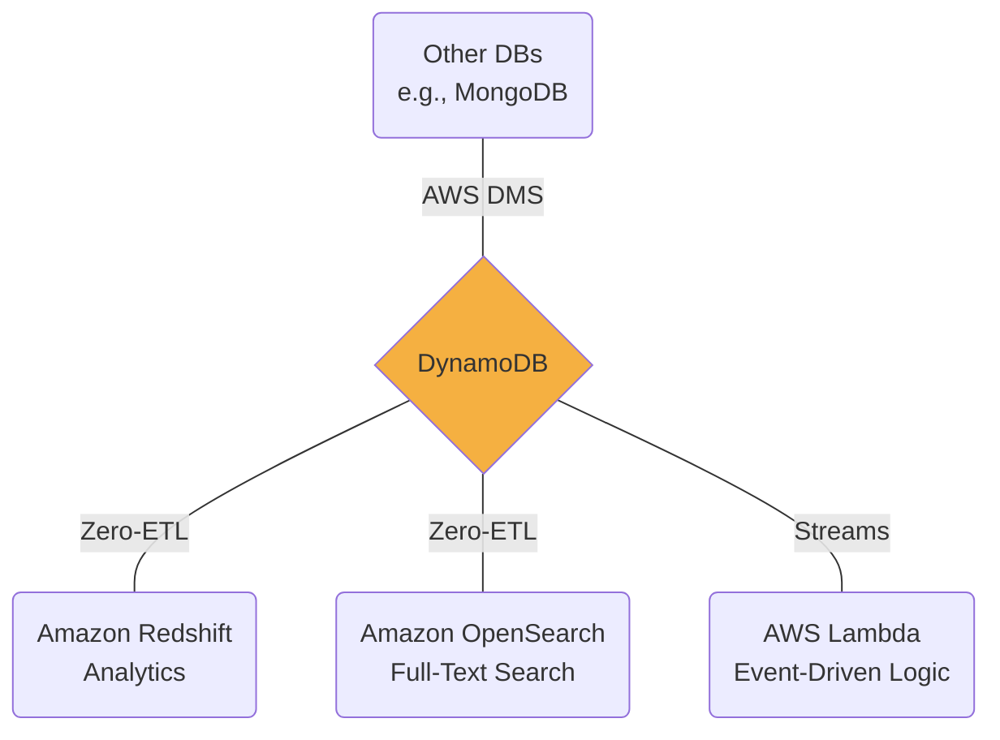

---
# Main frontmatter for the entire presentation
theme: seriph
title: 'Amazon DynamoDB: A Comprehensive Analysis'
author: 'Group 3'

# Enable downloading the presentation as a PDF from the web interface
download: true
# Set the favicon to our Daystar logo
favicon: '/daystar-logo.png'

# Enable syntax highlighting features
lineNumbers: true
---

<!-- 
This is the Title Slide. 
The layout 'cover' is a special layout that's often used for titles.
The background image is the Daystar logo we placed in the public folder.
-->
<div class="absolute top-1/2 left-1/2 transform -translate-x-1/2 -translate-y-1/2">
  
</div>

<div class="absolute bottom-12 text-center w-full">
  <h1 class="text-4xl font-bold">Amazon DynamoDB: A Comprehensive Analysis</h1>
  <p class="mt-4 text-lg">ACS362B: Advanced Database Management Systems</p>
  <p class="text-sm opacity-75">Mr. Watson Kanuku</p>
</div>

<!-- 
PRESENTER NOTES:
(William) -> Good morning/afternoon everyone. My name is William, and on behalf of Group 3, I'd like to welcome you to our presentation on Amazon DynamoDB. Over the next few minutes, we'll be exploring what makes this database a cornerstone of modern cloud applications.
Our group members are: [List names].
-->

---
layout: default
---

# Presentation Outline

<v-clicks>

1.  **Introduction**: What is DynamoDB?
2.  **Outstanding Characteristics**: The Core Features
3.  **Areas of Application**: Powering Industry Leaders
4.  **Access Mechanisms**: Backend & Frontend
5.  **Distribution & Optimization**: The Engine Under the Hood
6.  **Security & Integration**: A Robust Ecosystem
7.  **Conclusion**: Key Takeaways

</v-clicks>

<!-- 
PRESENTER NOTES:
(Presenter 2) -> Thank you, William.
Here's a quick look at our agenda for today. We'll start with a basic introduction to DynamoDB, then dive into its standout features. We'll look at real-world companies using it today, and then get into the technical details of how to access and optimize it. Finally, we'll cover security and integration before summarizing our key takeaways.
-->

---
layout: center
class: 'text-center'
---

# What is Amazon DynamoDB?

A fully managed, serverless, NoSQL database designed for **internet-scale applications**.

<div class="grid grid-cols-3 gap-8 mt-10">
  <div v-click>
    <div class="i-carbon-flash text-5xl text-yellow-500 mx-auto"></div>
    <h3 class="font-bold mt-2">Performance at Scale</h3>
    <p class="text-sm opacity-75">Single-digit millisecond latency, regardless of size.</p>
  </div>
  <div v-click>
    <div class="i-carbon-cics-sit-override text-5xl text-blue-500 mx-auto"></div>
    <h3 class="font-bold mt-2">Fully Managed</h3>
    <p class="text-sm opacity-75">No servers to provision, patch, or manage. It's serverless.</p>
  </div>
  <div v-click>
    <div class="i-carbon-document-multiple-01 text-5xl text-green-500 mx-auto"></div>
    <h3 class="font-bold mt-2">Flexible Schema</h3>
    <p class="text-sm opacity-75">Supports both Key-Value and Document data models.</p>
  </div>
</div>

<!--
PRESENTER NOTES:
(Presenter 2) -> So, what exactly is DynamoDB? At its core, it's a NoSQL database provided by AWS. But what makes it special are three key things.
First, its performance. It’s built to provide incredibly fast, single-digit millisecond response times, even when handling trillions of requests per day.
Second, it's fully managed and serverless. This is a game-changer because it means developers don't have to worry about the underlying hardware, software updates, or scaling. You just create a table and start using it.
And third, it offers a flexible schema. Unlike traditional relational databases, you don't have to define all your columns upfront. This makes it perfect for applications that need to evolve quickly.
-->

---
layout: default
---

# Outstanding Characteristics

<div class="grid grid-cols-2 gap-8">
<div>

### Core Features
<v-clicks>

- **Serverless Architecture**: Focus on code, not on servers.
- **Flexible Data Model**: Key-Value & Document stores.
- **Global Tables**: Active-active, multi-region replication for worldwide apps.
- **ACID Transactions**: Ensures data integrity across multiple items and tables.

</v-clicks>

</div>
<div>

### Advanced Capabilities
<v-clicks>

- **DynamoDB Accelerator (DAX)**: An in-memory cache for microsecond read latency.
- **DynamoDB Streams**: React to data changes in real-time.
- **Time to Live (TTL)**: Automatically expire and delete items to manage costs.

</v-clicks>

</div>
</div>

<!--
PRESENTER NOTES:
(Presenter 3) -> Building on that, let's look closer at its characteristics.
On the core side, we've already mentioned its serverless nature and flexible model. A key feature for global applications is Global Tables, which lets you create a single database that is replicated and active in multiple AWS regions at once. This gives users around the world fast, local access to their data. It also supports ACID transactions, which is a feature often associated with relational databases, guaranteeing data correctness.
On the advanced side, DAX, or DynamoDB Accelerator, provides an in-memory cache that can boost read performance from milliseconds to microseconds. And DynamoDB Streams is a powerful feature for building event-driven architectures; it allows you to trigger other processes, like an AWS Lambda function, whenever data in your table changes.
-->

---
layout: center
class: 'text-center'
---

# Areas of Application: Powering Industry Leaders

DynamoDB is trusted by thousands of companies for their most demanding applications.

<div class="grid grid-cols-3 gap-8 mt-10">
  <div v-click>
    <h3 class="font-bold">Media & Entertainment</h3>
    <div class="flex justify-center items-center space-x-4 mt-2">
      <div class="i-simple-icons-netflix text-4xl"></div>
      <div class="i-simple-icons-disneyplus text-4xl"></div>
    </div>
  </div>
  <div v-click>
    <h3 class="font-bold">E-commerce & SaaS</h3>
    <div class="flex justify-center items-center space-x-4 mt-2">
      <div class="i-simple-icons-amazon text-4xl"></div>
      <div class="i-simple-icons-dropbox text-4xl"></div>
    </div>
  </div>
  <div v-click>
    <h3 class="font-bold">FinTech & Education</h3>
    <div class="flex justify-center items-center space-x-4 mt-2">
      <div class="i-simple-icons-capitalone text-4xl"></div>
      <div class="i-simple-icons-duolingo text-4xl"></div>
    </div>
  </div>
</div>

<!--
PRESENTER NOTES:
(Presenter 3) -> So, who actually uses this? The answer is: some of the biggest names in tech.
In Media, Disney+ and Netflix use it to handle billions of user interactions daily, from updating watchlists to storing user profiles.
In E-commerce, Amazon's own retail site migrated many of its critical services to DynamoDB to handle its massive scale. SaaS companies like Dropbox use it for metadata storage.
And in FinTech and Education, companies like Capital One and Duolingo rely on it for its speed and reliability to power their mobile applications. This shows its versatility across many different industries.
-->

---
layout: default
---

# Backend Access: SDKs & CLI

The most common way to interact with DynamoDB is from a secure backend using AWS SDKs.

```python {all|3-4|7-14|17-21|24-29|32-35}
import boto3

# 1. Initialize the DynamoDB resource.
dynamodb = boto3.resource('dynamodb')
table = dynamodb.Table('Users')

# 2. Create (or overwrite) an item.
table.put_item(
   Item={
        'user_id': '12345',
        'username': 'johndoe',
        'email': 'johndoe@example.com'
    }
)

# 3. Read an item.
response = table.get_item(
    Key={'user_id': '12345'}
)
item = response.get('Item')

# 4. Update an item.
response = table.update_item(
    Key={'user_id': '12345'},
    UpdateExpression='SET #em = :new_email',
    ExpressionAttributeNames={'#em': 'email'},
    ExpressionAttributeValues={':new_email': 'john.doe@newdomain.com'},
)

# 5. Delete an item.
table.delete_item(
    Key={'user_id': '12345'}
)
```

<!--
PRESENTER NOTES:
(Presenter 4) -> Now let's get into how developers actually work with DynamoDB.
From the backend, the standard method is to use an AWS Software Development Kit, or SDK. AWS provides them for all major languages like Python, Java, and Node.js.
Here is a Python example using the Boto3 SDK.
First, you initialize the DynamoDB resource and get a reference to your table.
Then, you can perform standard CRUD—Create, Read, Update, and Delete—operations. Here, we are creating an item with `put_item`.
We can retrieve it with `get_item`, providing the key.
We can update specific attributes with `update_item`.
And finally, we can remove the item with `delete_item`.
The AWS Command Line Interface, or CLI, is also commonly used for scripting and administrative tasks.
-->

---
layout: default
---

# Frontend Access: The Secure Architecture

Direct frontend access is insecure. The best practice is to use an API layer.

<div class="w-full h-90 flex items-center justify-center">



</div>

<!--
PRESENTER NOTES:
(Presenter 4) -> What about accessing data from a frontend, like a web or mobile app?
It's critical that you **never** put your AWS credentials directly in your frontend code. This is a major security risk.
The correct and secure architecture is to build an API layer that acts as an intermediary. This diagram shows the standard serverless pattern.
The user's application makes a request to an Amazon API Gateway endpoint.
API Gateway then triggers an AWS Lambda function.
This Lambda function contains the backend logic, like the Python code we just saw, to securely interact with DynamoDB.
To handle user authentication, you would use a service like Amazon Cognito, which can authorize users and ensure they only have permission to access their own data.
-->

---
layout: default
---

# Distribution & Optimization

DynamoDB's performance comes from its distributed architecture and data modeling best practices.

<div class="grid grid-cols-2 gap-8 mt-6">
<div>

### Distribution


</div>
<div>

### Optimization Best Practices
<v-clicks>

- **High-Cardinality Partition Key**: Choose a key with many unique values (like `user_id`, `order_id`) to distribute data evenly. This prevents "hot partitions".
- **Use `Query` over `Scan`**: A `Query` operation is highly efficient as it targets specific items by key. A `Scan` reads the entire table and should be avoided in production.
- **Leverage Secondary Indexes**: Create Global Secondary Indexes (GSIs) to enable efficient queries on non-key attributes.
- **Manage Capacity**: Choose between **On-Demand** for unpredictable workloads and **Provisioned** for predictable traffic to optimize costs.

</v-clicks>

</div>
</div>

<!--
PRESENTER NOTES:
(Presenter 5) -> So, how does DynamoDB achieve this scale and performance? It boils down to two things: distribution and optimization.
For distribution, DynamoDB uses partitioning. When you write an item, it takes the **partition key** and passes it through a hash function. The output of this function determines which physical partition the data is stored on. This is why choosing a good partition key is so critical.
This leads us to optimization. The most important best practice is to design your data model around your access patterns. Choose a partition key with high cardinality—many unique values—to ensure your data is spread evenly across partitions. Always use the `Query` operation, which is very fast, and avoid using `Scan` which is slow and expensive. And finally, manage your costs by choosing the right capacity mode for your application's traffic pattern.
-->

---
layout: default
---

# Security & Integration

DynamoDB is secure by default and deeply integrated into the AWS ecosystem.

<div class="grid grid-cols-2 gap-8 mt-6">
<div>

### Multi-Layered Security
<v-clicks>

- **IAM (Identity & Access Management)**: Granular permissions for users and roles. The principle of least privilege is key.
- **Encryption at Rest & In-Transit**: Data is automatically encrypted by default.
- **VPC Endpoints**: Keep traffic between your application and DynamoDB within your private network.
- **CloudTrail Auditing**: Log all API calls for security and compliance monitoring.

</v-clicks>

</div>
<div>

### Seamless Integration

</div>
</div>

<!--
PRESENTER NOTES:
(Presenter 5) -> Security is built-in at every layer. Access is controlled by IAM, which allows you to define exactly who can do what. All data is encrypted both at rest on AWS servers and in-transit over the network. And all activity is logged for auditing.
Beyond security, DynamoDB's power is amplified by its integration with other AWS services.
A key feature is **Zero-ETL integrations**. This allows you to automatically replicate your DynamoDB data into services like Amazon Redshift for data analytics or OpenSearch for full-text search, without writing any complex data pipeline code.
For custom integrations, you can use DynamoDB Streams to trigger Lambda functions, or use the AWS Database Migration Service to move data between DynamoDB and other databases.
-->

---
layout: center
class: 'text-center'
---

# Conclusion & Key Takeaways

<v-clicks>

1.  **Scalable & Serverless by Default**
    <p class="text-lg opacity-75">DynamoDB is a premier choice for applications requiring massive scale with minimal operational overhead.</p>

2.  **Data Modeling is Everything**
    <p class="text-lg opacity-75">Performance and cost are directly tied to how you design your primary keys and access patterns. Think about your queries first.</p>

3.  **A Pillar of the AWS Ecosystem**
    <p class="text-lg opacity-75">Its true strength is amplified by its deep integration for security, analytics, and event-driven architectures.</p>

</v-clicks>

<!--
PRESENTER NOTES:
(William) -> To wrap things up, here are our key takeaways.
First, DynamoDB is a powerful, serverless database that's built for scale. If you're building a large-scale application and want to minimize operational work, it's an excellent choice.
Second, to use it effectively, you have to think differently than you would with a relational database. Your data model, especially your primary key, is the most important decision you'll make. Design for your access patterns.
And finally, DynamoDB doesn't exist in a vacuum. Its deep integration with the rest of the AWS ecosystem is what makes it a true pillar of modern cloud applications.
-->

---
layout: center
class: 'text-center'
---

# Thank You

## Questions?

<br/>

<p class="opacity-75">
Kimutai Edwin,
Niyomwungere Bonfils,
Mwambali Irenge Don-Beni,
Brave Joseph Irumva,
Kengere William N. Obino
</p>

<!--
PRESENTER NOTES:
(William) -> Thank you for your attention. We are now happy to answer any questions you may have.
-->